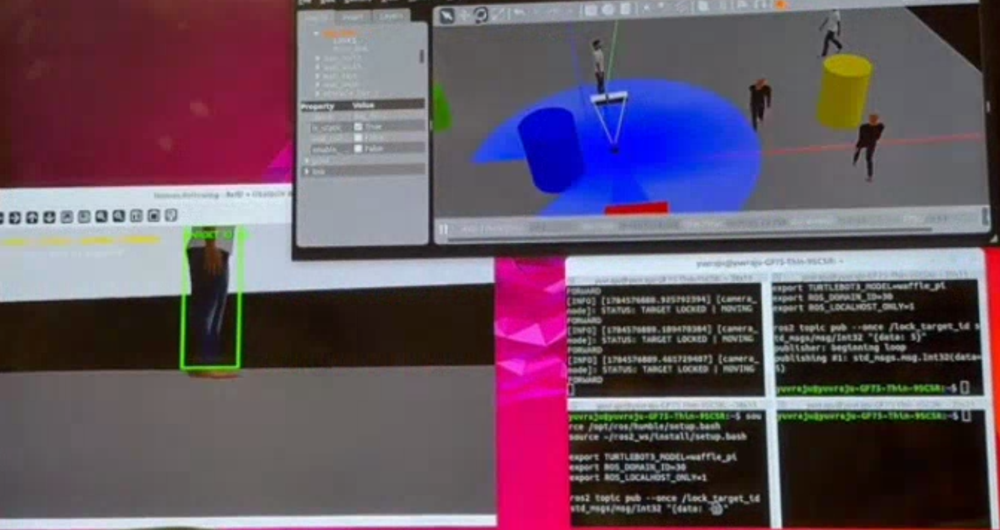
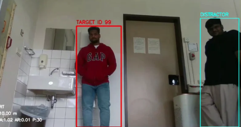
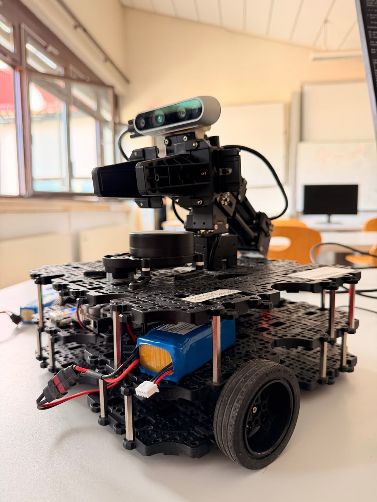

# Vision-Based Human Following Robot using ROS2 Humble and YOLOv8


---

## Table of Contents

- Project Overview
- Project Objectives
- Features
- Repository Structure
- Hardware Requirements
- Software Requirements
- Prerequisites
- Installation
- Build Instructions
- Running the Project
- ROS Topics
- Gazebo Worlds
- Algorithms Used
- Results
- Screenshots
- Future Work
- Troubleshooting
- Author
- License

---

# Project Overview

This project presents a **Vision-Based Human Following Robot** developed using **ROS2 Humble**, **Gazebo**, **OpenCV**, and **YOLOv8**. The system enables a TurtleBot3 Waffle Pi robot to detect, identify, lock onto, and follow a selected person using an RGB camera.

Unlike conventional human-following robots that simply follow the nearest detected person, this project provides a **Target Lock** mechanism that enables the robot to continuously follow a selected individual even when multiple people are present in the environment.

The project was first developed and validated in Gazebo simulation and later tested on the TurtleBot3 Waffle Pi hardware platform.

---

# Project Objectives

The objectives of this project are:

- Detect humans using YOLOv8.
- Track a selected target person.
- Follow the selected target.
- Lock onto one person in multi-person environments.
- Maintain a safe following distance.
- Validate the complete system on both Gazebo and TurtleBot3 hardware.

---

# Features

- Human Detection using YOLOv8
- Vision-Based Human Following
- Target Locking
- Multi-Person Detection
- Camera-Based Tracking
- LiDAR Safe Distance
- Gazebo Simulation
- TurtleBot3 Waffle Pi Hardware Validation
- ROS2 Humble Integration

---

# Repository Structure

```text
Vision_based_human_following_robot/
│
├── human_following_robot/
│   ├── camera_node.py
│   └── __init__.py
│
├── launch/
│   └── hospital_world.launch.py
│
├── worlds/
│   ├── hospital_human_world.world
│   └── big_square_human_world.world
│
├── resource/
│
├── test/
│
├── package.xml
├── setup.py
├── setup.cfg
├── run_big_square_sim.sh
└── README.md
```

---

# Hardware Requirements

- TurtleBot3 Waffle Pi
- RGB Camera
- LiDAR Sensor
- Ubuntu 22.04 Computer

---

# Software Requirements

- Ubuntu 22.04
- ROS2 Humble
- Gazebo Classic
- Python 3
- OpenCV
- NumPy
- cv_bridge
- Ultralytics YOLOv8

---

# Prerequisites

Before running the project, ensure that the following packages are installed:

- ROS2 Humble
- TurtleBot3 packages
- turtlebot3_gazebo
- Gazebo Classic
- OpenCV
- Python 3
- NumPy
- Ultralytics YOLOv8

The TurtleBot3 Gazebo packages must be available before launching the simulation.
---

# Installation

## 1. Create a ROS2 Workspace

```bash
mkdir -p ~/ros2_ws/src
cd ~/ros2_ws/src
```

---

## 2. Clone the Repository

Replace `<your-github-username>` with your GitHub username.

```bash
git clone https://github.com/<your-github-username>/Vision_based_human_following_robot.git
```

---

## 3. Build the Workspace

```bash
cd ~/ros2_ws

colcon build
```

---

## 4. Source the Workspace

```bash
source /opt/ros/humble/setup.bash
source ~/ros2_ws/install/setup.bash
```

---

# Running the Project

## Step 1 – Launch the Gazebo Simulation

The repository includes a helper shell script that launches the TurtleBot3 Waffle Pi in the custom Gazebo world.

```bash
chmod +x run_big_square_sim.sh
./run_big_square_sim.sh
```

---

## Step 2 – Configure the ROS2 Environment

Open a new terminal.

```bash
source /opt/ros/humble/setup.bash
source ~/ros2_ws/install/setup.bash

export TURTLEBOT3_MODEL=waffle_pi
export ROS_DOMAIN_ID=30
export ROS_LOCALHOST_ONLY=1
```

---

## Step 3 – Verify Required ROS Topics

Verify that the required ROS topics are available.

```bash
ros2 topic list | grep -E "cmd_vel|scan|odom|camera|image"
```

Expected topics include:

- `/camera/image_raw`
- `/scan`
- `/odom`
- `/cmd_vel`

---

## Step 4 – Run the Human Following Node

```bash
source /opt/ros/humble/setup.bash
source ~/ros2_ws/install/setup.bash

export TURTLEBOT3_MODEL=waffle_pi
export ROS_DOMAIN_ID=30
export ROS_LOCALHOST_ONLY=1

ros2 run human_following_robot camera_node
```

---

## Step 5 – Lock the Target

Once the desired target has been detected, publish the target lock message.

```bash
source /opt/ros/humble/setup.bash
source ~/ros2_ws/install/setup.bash

export TURTLEBOT3_MODEL=waffle_pi
export ROS_DOMAIN_ID=30
export ROS_LOCALHOST_ONLY=1

ros2 topic pub --once /lock_target_id std_msgs/msg/Int32 "{data: 1}"
```

The robot will continue following the selected target even when multiple people are detected.

---

# ROS Topics

| Topic | Description |
|--------|-------------|
| `/camera/image_raw` | RGB camera images |
| `/scan` | LiDAR scan data |
| `/odom` | Robot odometry |
| `/cmd_vel` | Velocity commands |
| `/lock_target_id` | Target locking topic |

---

# Gazebo Worlds

The repository contains two Gazebo environments.

- `big_square_human_world.world`
- `hospital_human_world.world`

These worlds were used to evaluate the human-following algorithm under different simulation scenarios.
---

# System Architecture

The overall workflow of the project is illustrated below.

```text
                   +----------------------+
                   | RGB Camera           |
                   +----------+-----------+
                              |
                              v
                   +----------------------+
                   | YOLOv8 Human Detector|
                   +----------+-----------+
                              |
                              v
                   +----------------------+
                   | Target Selection     |
                   | & Target Locking     |
                   +----------+-----------+
                              |
                              v
                   +----------------------+
                   | Human Following      |
                   | Controller           |
                   +----------+-----------+
                              |
                              v
                   +----------------------+
                   | /cmd_vel             |
                   +----------+-----------+
                              |
                              v
                   +----------------------+
                   | TurtleBot3 Waffle Pi |
                   +----------------------+
```

---

# Project Workflow

The execution sequence of the project is as follows:

1. Launch the Gazebo simulation.
2. Spawn the TurtleBot3 Waffle Pi robot.
3. Start the camera node.
4. Detect humans using YOLOv8.
5. Select the desired target.
6. Lock the selected target.
7. Continuously track the target.
8. Generate velocity commands.
9. Follow the selected target while maintaining a safe distance.

---

# Algorithms Used

The project combines multiple algorithms to achieve reliable human following.

## YOLOv8 Object Detection

YOLOv8 is used to detect humans from the RGB camera images in real time.

## Target Locking

A dedicated ROS2 topic enables the robot to lock onto one selected person, preventing target switching when multiple people are detected.

## Human Tracking

The detected person's position is continuously updated from incoming camera frames and used for robot motion control.

## Motion Controller

The controller computes the robot's linear and angular velocities and publishes them to the `/cmd_vel` topic.

## Safe Distance

LiDAR measurements are used to maintain a safe following distance from the target.

---

# Package Description

| Folder/File | Description |
|-------------|-------------|
| `human_following_robot/` | Main ROS2 Python package |
| `camera_node.py` | Human detection and following node |
| `launch/` | ROS2 launch files |
| `worlds/` | Gazebo simulation worlds |
| `resource/` | ROS2 package resources |
| `package.xml` | Package configuration |
| `setup.py` | Python package configuration |
| `setup.cfg` | Package settings |
| `run_big_square_sim.sh` | Gazebo launch script |

---

# Hardware Validation

The developed system was validated on the following hardware platform:

- TurtleBot3 Waffle Pi
- RGB Camera
- LiDAR Sensor

Hardware validation confirmed that the robot successfully:

- Detected humans
- Locked onto the selected target
- Followed the target
- Maintained a safe following distance

---

# Results

The developed system successfully demonstrated:

- Real-time human detection
- Stable target tracking
- Reliable target locking
- Smooth robot following
- Gazebo simulation testing
- TurtleBot3 hardware validation

The robot consistently followed the selected target in both simulated and hardware environments.
---

# Screenshots

The following screenshots demonstrate the functionality of the project.

## Gazebo Simulation



---

## Human Detection



---

## Target Lock


---

## TurtleBot3 Hardware Validation



---

# Troubleshooting

## Gazebo does not launch

Verify that Gazebo Classic and the TurtleBot3 Gazebo packages are correctly installed.

---

## Camera image is not available

Check whether the following topic exists:

```bash
ros2 topic list
```

The topic `/camera/image_raw` should be available.

---

## Robot does not move

Verify that the human-following node is running.

Check whether velocity commands are being published.

```bash
ros2 topic echo /cmd_vel
```

---

## Multiple people detected

If multiple people are detected, publish the target lock command again.

```bash
ros2 topic pub --once /lock_target_id std_msgs/msg/Int32 "{data: 1}"
```

---

# Future Work

Possible future improvements include:

- Dynamic obstacle avoidance
- Person re-identification
- DeepSORT integration
- Outdoor navigation
- Autonomous navigation using Nav2
- Multi-robot collaboration

---

# License

This project is released under the **MIT License**.

---

# Author

**Yuvraju Pediredla**

M.Sc. Robotics Engineering

ROS Case Study Project

---

# Acknowledgements

This project was developed as part of the ROS Case Study course using:

- ROS2 Humble
- Gazebo Classic
- TurtleBot3 Waffle Pi
- OpenCV
- Ultralytics YOLOv8

Special thanks to the course instructor and laboratory staff for providing guidance and hardware resources for project development and validation.

---

# Repository

GitHub Repository:

```
https://github.com/pediredlayuvaraju-ui/Vision_based_human_following_robot
```

---

## Thank You

Thank you for visiting this repository.

If you find this project useful, consider giving it a ⭐ on GitHub.
